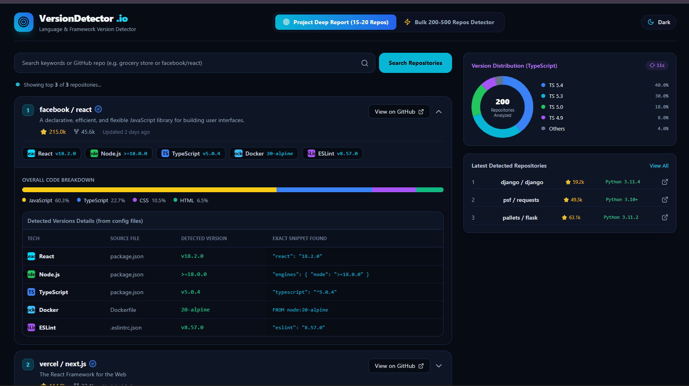
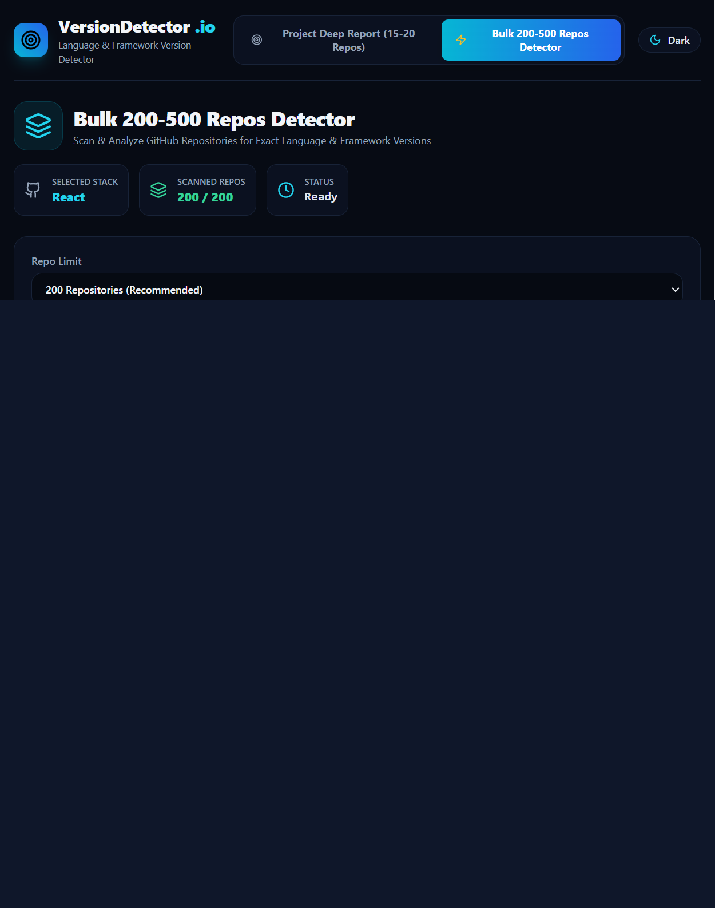

# 🔍 VersionDetector.io — Language & Framework Version Detector

[](https://reactjs.org/)
[](https://nodejs.org/)
[](https://tailwindcss.com/)
[](https://docs.github.com/en/rest)
[](LICENSE)

**VersionDetector.io** is a modern, full-stack web application designed to analyze public GitHub repositories and detect exact programming languages, runtimes, and framework versions. 

Instead of relying solely on GitHub's high-level language bytes, **VersionDetector.io** inspects actual repository configuration files (`package.json`, `pyproject.toml`, `pom.xml`, `go.mod`, `composer.json`, `Dockerfile`, etc.) to provide detailed, line-by-line version breakdowns.

---

## ✨ Features

### 🔬 1. Project Deep Report Mode (15–20 Repositories)
* **Keyword & Topic Search**: Search for specific project topics (e.g., `grocery store`, `e-commerce`, `machine learning`) or enter a direct GitHub repository URL (e.g., `facebook/react`).
* **Typo Tolerance**: Smart query formatting that handles spelling mistakes seamlessly.
* **Exact Code Snippets**: Displays the exact configuration file source line (e.g., `"react": "18.2.0"`, `FROM node:20-alpine`, `<java.version>17</java.version>`).
* **Instant Versions Summary Row**: Badges displayed directly under project descriptions for instant visibility without opening details.
* **Code Percentage Distribution**: Multi-color bar showing language byte distribution.

### ⚡ 2. Bulk 200–500 Repos Detector Mode
* **Quick Preset Categories**: Categorized preset buttons for both **Frontend** (`JavaScript`, `TypeScript`, `HTML/CSS`, `React`, `Vue`, `Angular`) and **Backend** (`Python`, `Java`, `Node.js`, `Go`, `PHP`, `Ruby`, `C#`).
* **Flexible Repo Limits**: Select limits between `50`, `100`, `200`, or `300` repositories.
* **Top 3 Most Used Versions Summary**: Automatically calculates and highlights the top 3 most frequently used versions with rank badges, repository counts, and percentages.
* **Dynamic Donut Chart**: Interactive Chart.js breakdown visualizing version distributions across all fetched repos.
* **1-Minute Auto-Updating Sidebar**: Live sidebar widget rotating popular language version stats every 60 seconds with an animated timer.
* **Paginated Results Table**: Clean table layout with GitHub links, star counts, and custom version badges.

### 🎨 3. UI/UX Features
* **Dual Theme Mode**: Toggle smoothly between **Slate Dark Mode** and **Crisp Light Mode**.
* **Brand Color Badges**: Official brand colors for technologies (React Cyan, Node Green, Python Blue, Java Orange, Docker Sky Blue).
* **Responsive Dashboard**: Split 2-column layout built for all screen sizes.

---

## 🛠️ Tech Stack

* **Frontend**: React 18, Tailwind CSS, Lucide React Icons, Chart.js (`react-chartjs-2`), Axios, Vite.
* **Backend**: Node.js, Express.js, Axios, NodeCache (In-memory caching with 15-min TTL), Dotenv.
* **API**: GitHub REST API v3.

---

## � Screenshots

Add your screenshots to the screenshots folder and reference them here:






## 📂 Project Structure

```text
language-version-detector/
├── backend/
│   ├── .env
│   ├── package.json
│   ├── server.js               # Express server & API routes
│   ├── versionDetector.js      # Configuration file parsing logic
│   └── repoAnalyzer.js         # Multi-repo deep inspection & snippet extraction
├── frontend/
│   ├── src/
│   │   ├── components/
│   │   │   ├── BulkDetectorDashboard.jsx  # Bulk 200-500 Repos Dashboard
│   │   │   ├── ProjectCardList.jsx         # Deep Report Accordion & Snippet Table
│   │   │   ├── SidebarPanel.jsx            # Auto-updating 1-min Version Overview
│   │   │   └── TechIcon.jsx                # Colorful Technology Brand Badges
│   │   ├── App.jsx                         # Main Header, Tabs & Theme Switcher
│   │   ├── index.css
│   │   └── main.jsx
│   ├── package.json
│   └── tailwind.config.js
├── screenshots/
└── README.md
